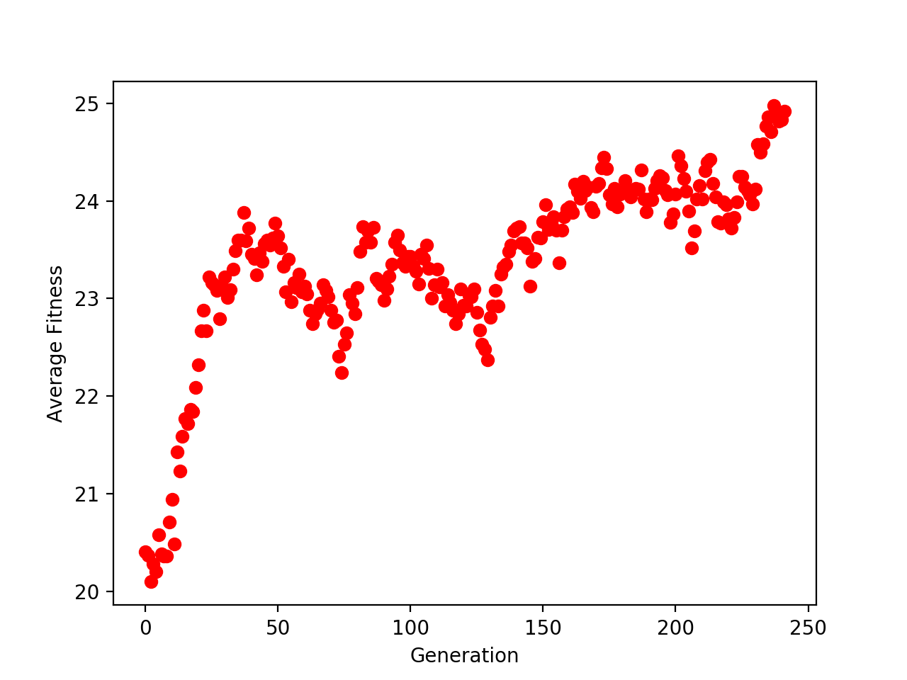

Evan DePosit  
2/21/20  
Winter 2020CS 441/541 Artificial Intelligence  
Programming Assignment #2  

# Write-UP

## Install
```
virtualenv -p python3 env   
source env/bin/activate  
python -m pip install matplotlib   
```

## To Run Code
```
python3 app.py <PopulationSize> <NumIterations> <MutationPct>
```
example: 
```
python3 app.py 100 1000 10
```
Or to use default values of: PopulationSize =100, NumIterations=1000,  and MutationPct = 10.  Simply enter:
```
python3 app.py
```

## Determining Fitness
Fitness is calculated as by counting up number of pairs of mutually non-attacking queens and subtracting it from 28.  A configuration with no pairs of attacking queens will have the highest score of 28.

## Mutations
`mutationPct` is the percent probability that a mutation will occur at random location in the string configuration of each child.  A random number is produced between 0 and 100 for each child.  If that number is lower than the `mutationPct` then a mutation occurs and replaces a random character in the configuration string with a random number from 0 to 7.

## Determining Breeding Pairs
Each generation, k new configurations are produced where k is equal to `PopulationSize`. To produce each new configuration two parent configurations are selected from the list of configurations from the previous generation.  Parents are chosen from the previous generation with a probability that is proportional to their fitness score.  This is implemented in the `get_reproducer` function.  The list of board configurations is sorted according to fitness score. In the `get_reproducer` function, a random fitness score is produced between 0 and sum of the populations fitness score.  A local fitness variable is initialized to zero, and the first individual in the list with the lowest fitness score is initially assigned to reproduce.  The function then loops through the sorted list.  During each iteration, the fitness score of the next individual is added to the local fitness variable and the next next individual is assigned to reproduce.  When the local fitness score variable is equal to or greater than the random fitness score, the loop terminates leading to individual from the later iteration being assigned to breed.  In this way, an individual's likely hood of breeding is proportional to their fitness score.   

## The Effect of Mutations on Completeness 
When the GA algorithm was complete I initially ran it a number of times before implementing the effect of mutations because the textbook had mentioned that it had been shown that mutations are not necessary to achieve solutions if the initial population was sufficiently large and diverse due to random starting configurations.  I experimented with various population sizes.  Significantly increasing the population size resulted in much longer run times because this increased the number of iterations of the inner loop where k number of children were produce where k is equal to to `PopulationSize`.  However, the program was never able to find the optimal solution even with very large `NumIterations`.  Once I implemented the mutations with probability equal to `MutationPct`, the GA was able to find the optimal solution within a relatively quickly every time the GA was run.  The `MutationPct` was initially set to ten.  The thinking was that in biological populations, mutations are rare and usually deleterious.  Although mutations are necessary to introduce new genetic variations, the mutation probability should not be too high, because most mutations are not beneficial.  Using a `MutationPct` of 10 with`PopulationSize` of 100 was sufficient to find the optimal solution within several hundred generations (iterations).  Once the solution is found, the GA halts and returns the solution, as it is not necessary for all individuals in population to reach the optimal solution.  

## Plot of Average Fitness over Generations

**The above figure shows the change in average fitness over generations.  Average Fitness was calculated by dividing the sum of the each individual configurations fitness score by `PopulationSize`.  Each generation represents one iteration of the outermost loop in the GA.**

## Random Individuals Sampled From Each Generation
Generation:0, Score:22, Configuration:60362746  
Generation:10, Score:22, Configuration:75157446  
Generation:20, Score:20, Configuration:00611416  
Generation:30, Score:25, Configuration:50667147  
Generation:40, Score:24, Configuration:50663140  
Generation:50, Score:24, Configuration:50614642  
Generation:60, Score:26, Configuration:70257144  
Generation:70, Score:21, Configuration:52664612  
Generation:80, Score:19, Configuration:54355141  
Generation:90, Score:19, Configuration:73236224  
Generation:100, Score:24, Configuration:52657314  
Generation:110, Score:22, Configuration:52653664  
Generation:120, Score:24, Configuration:53657414  
Generation:130, Score:20, Configuration:22654144  
Generation:140, Score:26, Configuration:02657114  
Generation:150, Score:25, Configuration:53647404  
Generation:160, Score:27, Configuration:52637414  
Generation:170, Score:26, Configuration:53637414  
Generation:180, Score:23, Configuration:53337461  
Generation:190, Score:23, Configuration:13627416  

## Solution
Configuration:13627504, Score:28
0   0   0   0   0   0   X   0   

X   0   0   0   0   0   0   0   

0   0   0   X   0   0   0   0   

0   X   0   0   0   0   0   0   

0   0   0   0   0   0   0   X   

0   0   0   0   0   X   0   0   

0   0   X   0   0   0   0   0   

0   0   0   0   X   0   0   0   